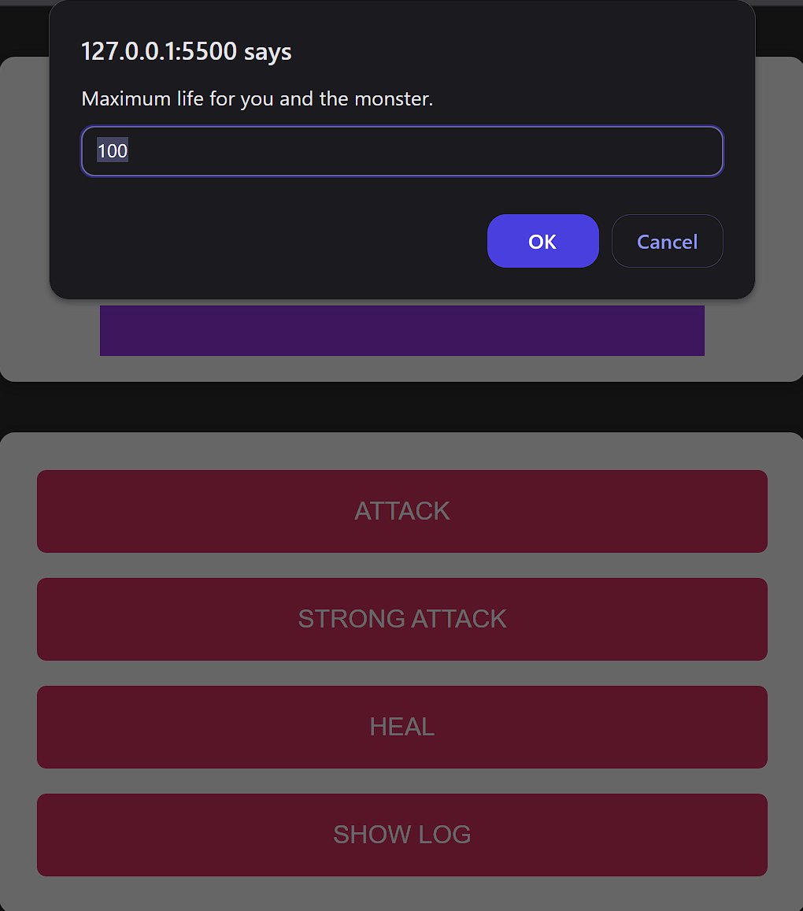
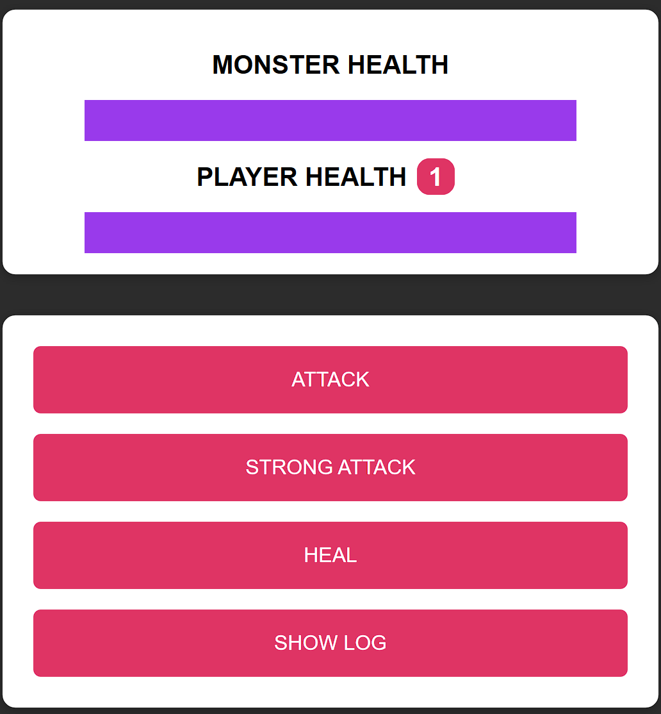
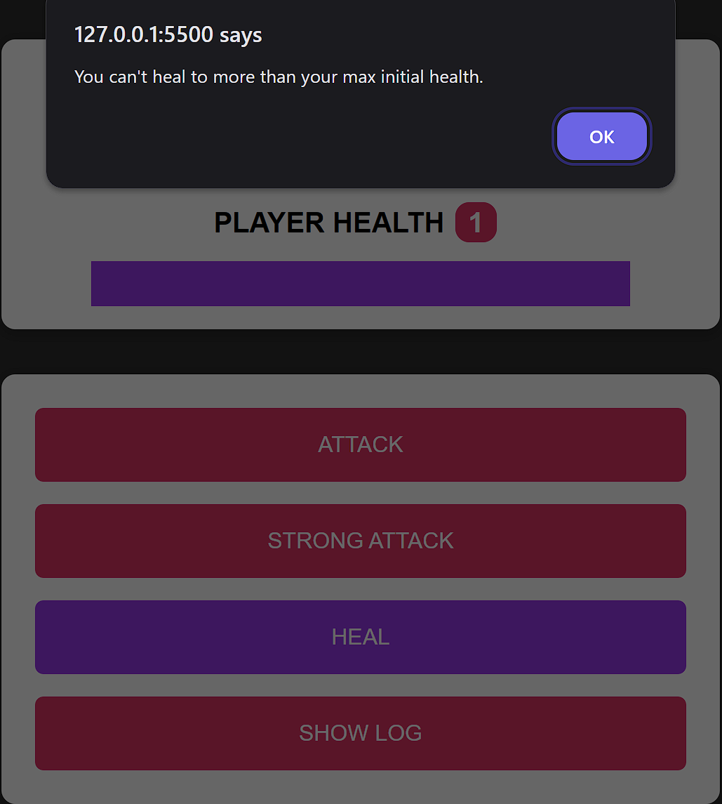

# The Monster Killer

## The Monster Killer is a browser-based, turn-based game built using HTML, CSS, and vanilla JavaScript. It was developed as part of the **"JavaScript – The Complete Guide 2025"** course on Udemy and serves as a practical exercise in applying core frontend development concepts.

The project demonstrates DOM manipulation, event handling, game state management, and dynamic UI updates without relying on external libraries or frameworks. It reflects a solid understanding of vanilla JavaScript and foundational web development principles.

## 🚀 Features

- 🎮 Turn-based combat system
- ❤️ Player and monster health tracking
- 💾 Bonus life mechanic
- 📜 Action log for each turn
- 🔄 Dynamic UI updates

# 🛠️ Technologies Used

- HTML5
- CSS3
- JavaScript (ES6+)

# 📁 Project Structure

/theMonsterKiller

├── index.html
├── assets/
│   ├── scripts/
│   │   ├── app.js
│   │   └── vendor.js
│   └── styles/
│       └── app.css
├── LICENSE             
└── README.md

## 🧩 Getting Started

To run the game locally:

1. **Clone the repository:**
   ```bash
   git clone https://github.com/George3211/theMonsterKiller.git
   cd theMonsterKiller

2. Open the game in your browser:

   - Simply double-click index.html, or
   - Use a live server extension (e.g., in VS Code)

⚠️ No build tools or installations needed – just open the file in your browser.

## 🖼️ Screenshots


### Home Screen


### Menu


### Heal Button


# Online Version

- You can view the project here: https://george3211.github.io/theMonsterKiller/

## 📄 License

This project is licensed under the MIT License – see the [LICENSE](LICENSE) file for details.

## 👨‍💻 Author

- Name: George Gulubov
- Course: [JavaScript – The Complete Guide 2025](https://www.udemy.com/course/javascript-the-complete-guide-2020-beginner-advanced/) by Academind
- GitHub: [George3211](https://github.com/George3211)